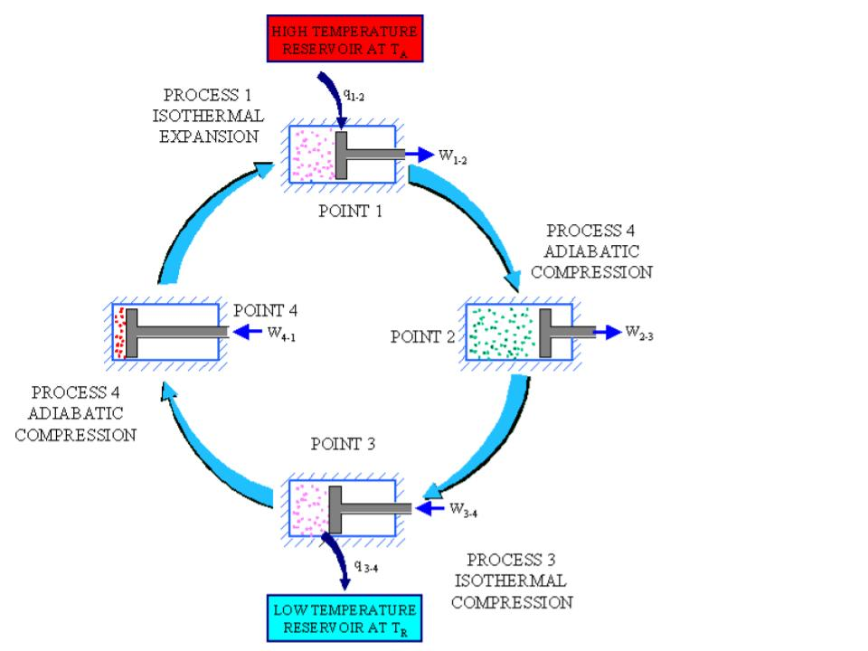

# TH05: Thermodynamic Cycles - Comprehensive Study Notes

## Note ID: 1
### Enabling Objective 1: Thermodynamic Cycles and Essential Elements

A **thermodynamic cycle** is a recurring series of thermodynamic processes used for the transformation of energy to produce a useful effect. When the working fluid goes through different changes of state (processes) and returns to its initial state, the system has undergone a cycle. The properties of the working fluid are the same at the beginning and end of the cycle.

#### Five Essential Elements of Any Thermodynamic Cycle

**1. A Working Fluid**
- The substance that operates through the cycle, absorbing and rejecting heat
- Examples: steam in power plants, air in jet engines, refrigerant in cooling systems
- Must have the ability to undergo phase changes and transport energy between heat source and heat sink

**2. An Engine (Conversion Device)**
- Equipment that converts heat energy into mechanical work
- Examples: turbines (rotating), pistons (reciprocating), compressors (pressurizing)
- The turbine in a power plant converts the enthalpy of steam into rotational shaft work that drives the generator

**3. A Heat Source (High-Temperature Reservoir)**
- The energy supply that provides thermal energy to the working fluid
- Examples: reactor (nuclear plants), boiler (fossil plants), solar radiation
- The temperature of the heat source directly affects cycle efficiency

**4. A Heat Sink (Low-Temperature Reservoir)**
- The final destination for waste heat rejected by the cycle
- Examples: condenser (cooling water), atmosphere (air cooling), cooling towers
- Temperature must be lower than the source for the cycle to operate

**5. A Device to Move the Working Fluid**
- Equipment that circulates the working fluid through the cycle
- Examples: pump (incompressible liquids), compressor (gases)
- Requires work input but is essential for continuous cycle operation
- In power plants, the feed pump returns condensate to the steam generator

#### Application in Power Plants

- **Heat source**: Nuclear reactor core heats primary system coolant
- **Working fluid**: Water in secondary system (steam) and primary system
- **Engine**: High-pressure turbine and low-pressure turbine extract energy
- **Heat sink**: Condenser connected to cooling water system
- **Circulating device**: Feed pump pressurizes condensate back to steam generator

---

## Note ID: 2
### Enabling Objective 2: Processes Versus Cycles

#### Understanding Thermodynamic Processes

A **process** is a change in the state of a system (a single step or series of steps in one direction). During a process, at least one property of the working fluid changes (pressure, temperature, volume, enthalpy, entropy). A process has a defined starting point and ending point but does not return to the starting state.

**Examples of Processes:**
- **Compression in pump**: pressure increases, specific volume decreases
- **Heat addition in boiler**: temperature increases, phase changes from liquid to vapor
- **Expansion in turbine**: pressure decreases, temperature decreases, work is output
- **Heat rejection in condenser**: temperature decreases, phase changes from vapor to liquid

#### Understanding Thermodynamic Cycles

A **cycle** is a series of processes that returns the working fluid to its initial state. After completing all processes, the properties (pressure, temperature, volume, enthalpy, entropy) return to exactly where they started. The working fluid undergoes a complete sequence and then repeats the same sequence.

#### Key Differences

| Aspect | Process | Cycle |
|--------|---------|-------|
| **Path** | Single directional change | Series of changes ending at start |
| **Direction** | Linear (A→B) | Closed loop (A→B→C→D→A) |
| **Repetition** | Not repeating (one-time) | Repeating pattern (continuous) |
| **Application** | One-time operations | Engines and energy conversion |
| **Entropy** | Can increase indefinitely | Net change is zero (ideal) |

#### Example: The Rankine Cycle as Four Processes

- **Process 1→2 (Pump)**: Isentropic compression of liquid
- **Process 2→3 (Boiler)**: Isobaric heat addition
- **Process 3→4 (Turbine)**: Isentropic expansion
- **Process 4→1 (Condenser)**: Isobaric heat rejection

These four processes form one complete cycle, after which the cycle repeats.

#### Continuous Operation

Power plants operate in continuous cycles because they must generate electricity constantly. Each cycle repeats thousands of times per hour. The cyclic nature allows continuous energy conversion from heat (from fuel/reactor) to work (rotating turbine shaft) to electricity (in generator).

**Representing Cycles:**
- **T-s diagrams**: Show heat transfer on temperature-entropy plots
- **P-v diagrams**: Show work on pressure-volume plots
- **Enclosed area**: Represents net work produced

---

## Note ID: 3
### Enabling Objective 3: Thermodynamic Cycle Efficiency

#### Efficiency Definition

**Thermodynamic cycle efficiency (η)** is the ratio of net work produced by the cycle to the total heat energy supplied to the cycle, expressed as a percentage. It represents the fraction of energy input that is converted to useful work output.

#### Efficiency Equation

```
η = (W_NET / Q_ADDED) × 100%

Or equivalently:
η = (Q_ADDED - Q_REJECTED) / Q_ADDED × 100%
```

**Where:**
- **W_NET** = Net work output from the cycle (turbine work minus pump work)
- **Q_ADDED** = Total heat energy supplied to the working fluid (from reactor/boiler)
- **Q_REJECTED** = Heat energy rejected from the working fluid (to condenser/atmosphere)

#### First Law of Thermodynamics Application

The First Law states that energy cannot be created or destroyed, only transformed. For the cycle:

```
Energy In = Energy Out
Q_ADDED = W_NET + Q_REJECTED
```

All energy supplied must be accounted for: some becomes work (useful output) and the remainder becomes rejected heat (waste).

#### Second Law Implication

The Second Law of Thermodynamics requires that in any real cycle, some heat must be rejected to the environment. It is impossible to convert 100% of input heat to work. Therefore:

- Efficiency is always less than 100%
- Q_REJECTED can never be zero
- Real efficiency is further reduced by irreversibilities (friction, turbulence, heat loss)

#### Practical Efficiency Values for Power Plants

- **Nuclear power plants**: 33-35% efficiency (lower due to safety constraints)
- **Coal-fired plants**: 35-40% efficiency
- **Natural gas combined cycle**: 45-55% efficiency
- **Ideal Carnot cycle** (for comparison): 50-60% (theoretical maximum)

#### Example Efficiency Calculation

```
Reactor supplies: 1000 MW thermal power
Turbine extracts: 400 MW mechanical power
Feed pump requires: 20 MW mechanical power

Net work = 400 - 20 = 380 MW
Efficiency = 380 / 1000 = 38%
```

#### The Relationship to Heat Rate

**Heat rate (HR)** is the inverse of efficiency:
```
HR (BTU/kW-hr) = 3,412 / Efficiency (%)
```

A plant with 38% efficiency has heat rate = 3,412 / 0.38 = 8,979 BTU/kW-hr

#### Improving Cycle Efficiency

The only ways to improve efficiency are to:
1. Increase heat supplied at higher temperature (increase Q_ADDED temperature)
2. Decrease heat rejected at lower temperature (decrease Q_REJECTED temperature)
3. Reduce losses in turbine and pump (reduce irreversibilities)

---

## Note ID: 4
### Enabling Objective 4: The Carnot Cycle and Power Plant Relevance

#### Historical Development

**Nicholas Leonard Sadi Carnot** (1796-1832), a French physicist, developed the concept of the idealized cycle and reversible processes. The Carnot cycle is not actually used in power plants but serves as a theoretical benchmark for evaluating real cycle performance.



#### Definition of Carnot Cycle

The **Carnot cycle** is an ideal heat engine cycle that converts heat into work through completely reversible processes. It employs reversible adiabatic (isentropic) work production and transfers heat only at the constant temperatures of the heat source and heat sink. The Carnot cycle has the highest possible thermal efficiency for any heat engine operating between two given constant temperature reservoirs.

#### The Four Processes in Carnot Cycle

**1. Process 1→2: Isothermal (Constant Temperature) Expansion**
- Cylinder containing gas is in contact with a heat source at T_hot
- Heat flows reversibly from the reservoir to the gas
- Gas expands at constant temperature, doing work against external pressure
- Piston moves outward
- **Key properties:**
  - Temperature: constant (T_hot)
  - Entropy: increases
  - Volume: increases
  - Pressure: decreases
  - Work output: positive

**2. Process 2→3: Adiabatic (No Heat Transfer) Expansion**
- Cylinder is removed from the heat source
- Gas expands adiabatically (no heat flows in or out)
- Gas cools as it expands, doing work against external pressure
- **Key properties:**
  - Temperature: decreases
  - Entropy: constant (isentropic)
  - Volume: increases
  - Pressure: decreases
  - Work output: positive

**3. Process 3→4: Isothermal (Constant Temperature) Compression**
- Cylinder is in contact with a heat sink at T_cold
- Piston isothermally compresses the gas, transferring heat to the sink
- Work must be done on the gas
- **Key properties:**
  - Temperature: constant (T_cold)
  - Entropy: decreases
  - Volume: decreases
  - Pressure: increases
  - Work input: negative (work done on system)

**4. Process 4→1: Adiabatic (No Heat Transfer) Compression**
- Cylinder is removed from the heat sink
- Piston returns gas to initial state by adiabatic compression
- **Key properties:**
  - Temperature: increases
  - Entropy: constant (adiabatic)
  - Volume: decreases
  - Pressure: increases
  - Work input: negative

#### Ideal Assumptions in Carnot Cycle

1. Both work processes occur with no friction (ΔS = 0)
2. Heat addition/rejection occur with no temperature difference (reversible)
3. All processes are perfectly reversible with no irreversibilities

#### Relevance to Power Plant Design and Operation

Although the Carnot cycle cannot be practically achieved in real power plants, it is extremely important because:

**1. Establishes Theoretical Efficiency Limits**
- Demonstrates the maximum possible efficiency for any real cycle
- Real plants can work to approach this limit but never reach it
- Provides the theoretical maximum for given temperature operating range

**2. Shows Importance of Temperature Difference**
- Carnot efficiency depends only on absolute temperatures
- To improve efficiency, designers must either:
  - Increase steam generator temperature (higher T_hot)
  - Decrease condenser temperature (lower T_cold)
- This is why modern plants use high steam pressure/temperature and vacuum condensers

**3. Guides Design Improvements**
- Motivates many power plant improvements:
  - Superheat: raises heat source temperature
  - Feedwater heating: preheats condensate, reducing energy needed
  - Condenser vacuum: lowers heat sink temperature
  - Reduced losses: gets closer to reversible processes

**4. Independent of Working Fluid Type**
- Proves that efficiency depends only on temperatures
- Not on the choice of working fluid (steam, air, helium, etc.)
- Shows that water is a practical choice for nuclear plants

---

## Note ID: 5
### Enabling Objective 5: Calculating Carnot Efficiency

#### Carnot Efficiency Formula

```
η_Carnot = (T_hot - T_cold) / T_hot = 1 - (T_cold / T_hot)
```

**Where:**
- **T_hot** = absolute temperature of heat source (Rankine or Kelvin)
- **T_cold** = absolute temperature of heat sink (Rankine or Kelvin)
- **CRITICAL**: Temperatures must be in absolute scale (not Celsius or Fahrenheit)

#### Absolute Temperature Conversion

Temperatures must be converted to absolute scale:
- **For Fahrenheit**: T_Rankine = T_°F + 459.67 (approximately +460)
- **For Celsius**: T_Kelvin = T_°C + 273.15

#### Example 1: Heat Engine at 540°F Receiving and 60°F Rejecting

**Step 1: Convert temperatures to Rankine**
```
T_hot = 540°F + 460 = 1000°R
T_cold = 60°F + 460 = 520°R
```

**Step 2: Apply Carnot efficiency formula**
```
η = (1000 - 520) / 1000 = 480 / 1000 = 0.48 = 48.0%
```

**Step 3: Interpretation**
The maximum theoretical efficiency possible for an engine operating between these two temperatures is **48%**. Any real engine operating between 540°F and 60°F would achieve significantly less due to irreversibilities.

#### Example 2: Steam Engine with 300 PSIA Steam Exhausting to Atmosphere

**Step 1: Determine saturation temperatures from steam tables**
```
At 300 psia: saturation temperature = 417.37°F
At 14.696 psia (atmosphere): saturation temperature = 212°F
```

**Step 2: Convert to Rankine**
```
T_hot = 417.37°F + 460 = 877.37°R
T_cold = 212°F + 460 = 672°R
```

**Step 3: Calculate Carnot efficiency**
```
η = (877.37 - 672) / 877.37 = 205.37 / 877.37 = 0.234 = 23.4%
```

**Step 4: Interpretation**
A steam engine with 300 psia saturated steam exhausting to atmosphere can achieve a maximum theoretical efficiency of **23.4%**. Actual steam turbines operate at 15-20% efficiency due to real turbine losses.

#### Sensitivity to Temperature Changes

Small changes in temperature have significant effects on Carnot efficiency:

- If T_hot increases by 50°F (1000→1050°R): η = 50.5% (2.5% absolute gain)
- If T_cold decreases by 10°F (520→510°R): η = 49.0% (1.0% absolute gain)

This demonstrates why power plants invest in:
- Higher steam pressures (higher T_hot)
- Vacuum condensers (lower T_cold)

#### Formula Variations

The same equation expressed three ways:

**Method 1: Temperature difference**
```
η = ΔT / T_hot = (T_hot - T_cold) / T_hot
```

**Method 2: Temperature ratio**
```
η = 1 - (T_cold / T_hot)
```

**Method 3: As percentage**
```
η (%) = [1 - (T_cold / T_hot)] × 100
```

All three give identical results.

---

## Note ID: 6
### Enabling Objective 6: Second Law of Thermodynamics Impact on Plant Design and Operation

#### The Second Law of Thermodynamics Statement

> "No heat engine, actual or ideal, when operating in a cycle can convert all the heat supplied to it into mechanical work."

#### Implications of the Second Law

**1. Heat Rejection is Mandatory**
- Every cycle must reject some heat to continue operating
- The equation Q_added = W_net + Q_rejected proves this
- If all heat became work (Q_rejected = 0), efficiency would be 100% (violates Second Law)
- Q_rejected must always be greater than zero

**2. All Real Processes are Irreversible**
- Friction dissipates mechanical energy as heat
- Temperature differences cause irreversible heat transfer
- Turbulent flow wastes energy
- No process in the real world is perfectly reversible

**3. Entropy Always Increases in Real Processes**
- Ideal (reversible) processes: ΔS = 0
- Real (irreversible) processes: ΔS > 0
- Real turbines, pumps, and heat exchangers all increase entropy

**4. Irreversibility Reduces Cycle Efficiency**
- Real turbine: higher exit entropy means higher enthalpy (more energy left in steam)
- Real pump: higher exit entropy means more work needed for compression
- Real boiler: heat transfer across finite ΔT generates irreversible entropy increase
- Result: Real cycle efficiency < Ideal cycle efficiency

#### Impact on Power Plant Design

**Design Approach 1: Maximize Temperature Difference**
- Since η_max = 1 - (T_cold / T_hot), designers focus on:
  - Increase steam generation temperature: higher pressure in boiler (up to ~3500 psia material limits)
  - Decrease cooling water temperature: deep vacuum in condenser (down to 0.5 psia absolute)
  - Temperature difference between hot and cold reservoirs is the primary design driver

**Design Approach 2: Minimize Irreversibilities**
- Use high-efficiency turbines (isentropic efficiency: ~90%)
- Minimize friction through polished surfaces and vibration control
- Use multiple extraction stages to reduce throttling losses
- Install feedwater heaters to approach isentropic process heating
- Use moisture separator/reheater to reduce moisture content (friction reducer)

**Design Approach 3: Employ Multiple Improvement Strategies**
Modern power plant designs use multiple methods simultaneously:
- Superheat: increases steam temperature above saturation
- Reheat (in MSR): dries steam between turbine stages
- Feedwater heating: reduces heat input requirement by preheating condensate
- Multiple pressure turbines: expands steam in stages with different pressures
- Vacuum condenser: maintains low backpressure on turbine

#### Impact on Power Plant Operation

**Operational Principle 1: Understanding Losses**
- Some efficiency loss is inevitable due to the Second Law
- Operators can minimize unnecessary losses through:
  - Maintaining steam purity (high quality)
  - Minimizing air leaks into condenser
  - Fixing steam leaks immediately
  - Optimizing feedwater temperature
  - Keeping condenser tubes clean

**Operational Principle 2: Efficiency Optimization at Full Load**
- Power plants are most efficient at full load because:
  - Turbine operates at design point with highest isentropic efficiency
  - Heat addition occurs at highest temperature
  - Auxiliary systems operate at optimal efficiency
  - Throttling losses are minimized
  - All feedwater heaters produce maximum benefit

**Operational Principle 3: Continuous Monitoring**
- Operators monitor efficiency through:
  - Heat rate (BTU/kW-hr): inverse measure of efficiency
  - Comparing electrical output to reactor power
  - Trending efficiency changes over time
  - Investigating any efficiency loss (indicates maintenance need)

#### Second Law as Design Limit

The Second Law sets an absolute upper limit that no engineer can overcome:
- Maximum efficiency for steam cycle: 60-65% (theoretical Carnot at realistic temperatures)
- Actual power plants achieve: 33-40% (nuclear), 35-45% (coal), 45-55% (gas)
- Difference represents real-world irreversibilities
- Continuous improvement focuses on reducing this gap

---

## Note ID: 7
### Enabling Objective 7: Rankine Versus Carnot Cycle

#### Rankine Cycle Overview

The **Rankine cycle**, developed by Scottish engineer William Rankine, is a more realistic cycle that closely approximates the processes occurring in actual steam power plants. While the Carnot cycle is purely theoretical, the Rankine cycle can be practically achieved in real equipment.

#### Rankine Cycle Processes

**1. Process 1→2 (Pump): Isentropic liquid compression**
- Liquid water at low pressure is compressed to high pressure
- Volume decreases slightly (liquid is nearly incompressible)
- Temperature increases slightly
- Work input: W_pump = m × (h_out - h_in)

**2. Process 2→3 (Boiler): Isobaric (constant pressure) heat addition**
- High-pressure liquid is heated at constant pressure
- Liquid temperature increases to saturation
- Phase change occurs (liquid→vapor) at constant temperature
- Temperature increases further if superheated
- Work: None (constant pressure heating in boiler)

**3. Process 3→4 (Turbine): Isentropic expansion**
- High-pressure steam expands adiabatically through turbine
- Pressure and temperature decrease significantly
- Volume increases greatly
- Work output: W_turbine = m × (h_in - h_out)

**4. Process 4→1 (Condenser): Isobaric (constant pressure) heat rejection**
- Low-pressure steam rejects heat at constant pressure
- Phase change occurs (vapor→liquid) at constant temperature
- Temperature decreases to saturation then below
- Heat rejected: Q_rejected = m × (h_in - h_out)
- Pump inlet: subcooled liquid ready to return to boiler

#### Comparison: Rankine vs. Carnot

| Characteristic | Carnot Cycle | Rankine Cycle |
|---|---|---|
| **Heat source temp** | Isothermal (constant T) | Isobaric (constant P) |
| **Heat sink temp** | Isothermal (constant T) | Isobaric (constant P) |
| **Work processes** | Two adiabatic processes | Two adiabatic processes |
| **Reversibility** | Completely reversible | Idealized (still reversible) |
| **Phase change** | Occurs during expansion | Occurs during heat transfer |
| **Analysis method** | T-s diagram (temperature-entropy) | Uses steam tables (enthalpy values) |
| **Working fluid** | Any gas or liquid | Practically: only steam |
| **Efficiency range** | Highest theoretical | Lower than Carnot |
| **Real-world feasibility** | Cannot be built | Can be approximated in real plants |
| **Use in practice** | Theoretical benchmark only | Basis for actual steam turbine plants |

#### Key Differences in Processes

**Carnot Heat Addition: Isothermal process**
- Heat is added while temperature stays constant
- Enthalpy increases, entropy increases
- All heat added contributes to work (no temperature "waste")
- Impossible in real plants (steam would remain at one temperature)

**Rankine Heat Addition: Isobaric process**
- Heat is added at constant pressure
- Liquid temperature increases from subcooled to saturation
- Phase change occurs at saturation (isothermal at saturation pressure)
- Temperature increases further if superheated
- Practical because boilers heat at constant pressure naturally

#### Efficiency Comparison

```
Using Carnot cycle: η_Carnot = 1 - (T_cold / T_hot)
Using Rankine: η_Rankine = W_net / Q_added = (Q_added - Q_rejected) / Q_added

For the same temperature limits:
η_Rankine < η_Carnot
```

**Example:** Operating between 500°F (960°R) and 70°F (530°R)
- Carnot efficiency = 1 - (530/960) = 44.8%
- Rankine efficiency ≈ 40% (depends on specific design)

#### Practical Advantage of Rankine

Despite lower efficiency, Rankine is used in all real power plants because:

1. **Actual heat transfer mechanisms operate at constant pressure** - Boilers and condensers naturally operate at constant pressure
2. **Steam tables provide direct values** - All properties tabulated at specific pressures/temperatures
3. **Equipment exists to build it** - Proven designs for turbines, boilers, pumps, condensers
4. **Irreversibilities are more controllable** - High-quality equipment minimizes real-world losses
5. **Continuous improvement is practical** - Engineers can approach Carnot efficiency through component improvements

#### Modern Power Plant: Practical Rankine with Improvements

Actual nuclear and fossil plants use modified Rankine cycles with:
- Superheating of steam (raises average heat addition temperature)
- Moisture separator/reheater (improves turbine efficiency)
- Multiple feedwater heaters (reduces average heat addition needed)
- Multiple turbine stages (approximates continuous expansion)
- Vacuum condenser (lowers average heat rejection temperature)

These improvements move the practical Rankine efficiency closer to the theoretical Carnot maximum.

---

## Note ID: 8
### Enabling Objective 8: Rankine Efficiency Improvements - Seven Factors Analyzed

#### Part A: Superheating Steam

**Basic Effect:**
Superheating is heating steam above its saturation temperature at a given pressure. Superheated steam has higher enthalpy and lower humidity than saturated steam at the same pressure.

**Why it improves efficiency:**
- Increases the temperature at which heat is added to the cycle
- Higher temperature means higher average heat addition (closer to Carnot ideal)
- More work is extracted from turbine (higher enthalpy at inlet)
- Heat rejection remains approximately the same
- Net result: efficiency gain of 2-5% per 100°F of superheat

**Typical values:**
- Saturated steam at 1000 psia: 544.6°F, h = 1449.5 BTU/lbm
- Superheated to 600°F at 1000 psia: h = 1493.2 BTU/lbm (+43.7 BTU/lbm)
- Modern plants: 900-1100°F superheat (safety and metallurgy limits)

#### Part B: Moisture Separator and Reheater (MSR)

**Primary Function:**
The MSR removes moisture from steam exiting the high-pressure turbine and reheats it before entering the low-pressure turbine.

**Efficiency Effect:**
- Direct efficiency gain: Minor (approximately 0-1%)
- Primary purpose: **Protect turbine** from water droplet erosion damage
- Secondary benefit: Slightly increases turbine work output
- Important for cycle reliability, not primary efficiency driver

**Why moisture is bad:**
- Water droplets at high speed cause blade erosion
- Reduces blade life significantly
- Can cause catastrophic turbine damage if severe

#### Part C: Feedwater Heating

**Process:**
Feedwater heating uses extraction steam from the turbine to preheat condensate before it returns to the steam generator.

**How it improves efficiency:**
1. Extracts steam from turbine at intermediate pressure/temperature
2. Uses that steam to heat feedwater in a heat exchanger
3. Condensed extraction steam drains to condenser
4. Net effect:
   - Decreases heat that must be added by reactor (less Q_added)
   - Decreases heat rejected by condenser (less Q_rejected)
   - Reduction in Q_added is greater than loss of turbine work
   - **Result: Overall cycle efficiency increases by 1-3% per heater**

**Typical feedwater heating train:**
- 5-8 feedwater heaters in modern plants
- Total efficiency gain: 5-15% improvement

#### Part D: Condenser Vacuum Improvement

**Process:**
Improving condenser vacuum means decreasing the absolute pressure in the condenser (better evacuation of non-condensables).

**Efficiency Effect:**
- As condenser vacuum improves (pressure decreases), saturation temperature decreases
- Lower saturation temperature at condenser outlet means higher turbine outlet expansion ratio
- More work extracted from turbine
- Heat rejected at lower temperature
- **Result: Efficiency gain of approximately 0.5-1.0% per inch of mercury improvement**

**Example:**
- Current condenser vacuum: 2 inches Hg absolute (0.68 psia)
- Improved vacuum: 1 inch Hg absolute (0.49 psia)
- Efficiency improvement: ~0.75%

#### Part E: Condensate Depression (Subcooling)

**Definition:**
Condensate depression is the temperature difference between the saturation temperature at existing condenser pressure and the actual temperature of the condensate in the hotwell.

**Efficiency Effect:**
- **Increasing condensate depression DECREASES efficiency**
- More subcooled condensate requires more heat from reactor to reach saturation
- Additional sensible heat must be supplied (wasted energy)
- **Minimize condensate depression for better efficiency**

**Typical acceptable values:**
- Minimum acceptable: 3-5°F
- Normal operating: 5-15°F
- Excessive (indicates problem): >20°F

**Example:**
At 1 psia absolute:
- Saturation temperature ≈ 102°F
- Hotwell temperature: 96°F (measured)
- Condensate depression = 102 - 96 = 6°F

#### Part F: Increasing Steam Temperature and Pressure

**Effects:**
- Higher steam temperature: Raises heat addition temperature (closer to Carnot ideal)
- Higher steam pressure: Increases differential pressure across turbine, more work extracted

**Efficiency Improvement:**
- Typical gain: 1-2% efficiency per 100°F temperature increase
- Typical gain: 0.5-1.5% efficiency per 500 psia pressure increase

**Limitations:**
- Material strength limits (~3500 psia for modern steels, ~1100°F for nickel alloys)
- Boiler design complexity increases
- Cost of higher-pressure equipment

#### Part G: Decreased Steam Quality (Moisture Content)

**Definition:**
Steam quality (dryness fraction) is the fraction of vapor in a two-phase mixture:
- Quality = 1.0: 100% vapor (dry steam)
- Quality = 0.9: 90% vapor, 10% liquid (wet steam)
- Quality < 0.85: Unacceptable (excessive moisture)

**Efficiency Effect:**
- **Lower quality DECREASES efficiency**
- Wet steam contains liquid, which has much lower enthalpy than vapor
- Less work available from turbine (lower inlet enthalpy)
- Blade erosion increases turbine losses
- **Typical minimum acceptable quality: 95-99% to prevent excessive blade damage**

**Why quality matters:**
- Each 1% decrease in quality ≈ 0.5-1% efficiency loss
- Protecting quality is critical operational concern

---

## Note ID: 9
### Enabling Objective 9: Condensate Depression and Subcooling Effects

#### Condensate Depression Definition with Numerical Example

**Condensate depression** = Saturation temperature at condenser pressure - Hotwell temperature

**Numerical Example:**

At 1 psia absolute (typical condenser pressure):
- Saturation temperature from steam tables ≈ 102°F
- Actual hotwell temperature (measured) = 96°F
- **Condensate depression = 102°F - 96°F = 6°F** (six degrees of depression)

#### Why Condensate Depression Matters

**Thermodynamic Impact:**
- The feed pump takes water at 96°F (below saturation)
- Must heat it from 96°F → 102°F (saturation) just to get to boiler inlet conditions
- This requires additional energy input from the reactor
- That energy doesn't contribute to useful work (wasted as recovery sensible heat)

**Efficiency Formula Adjustment:**
If condensate depression increases, Q_added increases:
```
Higher Q_added (for same work output)
→ Lower efficiency = W_net / Q_added
```

#### Maintaining Optimal Condensate Depression

**Acceptable Range:** 3-15°F
- **Minimum (ideal)**: 3-5°F (indicates excellent condenser performance)
- **Normal operating**: 5-12°F (acceptable)
- **Marginal**: 15-20°F (indicates maintenance needed)
- **Excessive (>20°F)**: Serious problem requiring investigation

#### Common Causes of Excessive Condensate Depression

1. **Air leaks into condenser** - Non-condensables increase saturation temperature
2. **Condenser tubes fouled** - Reduced heat transfer prevents cooling
3. **Insufficient cooling water flow** - Can't remove heat efficiently
4. **High cooling water temperature** - Reduces cooling capability
5. **Condenser vacuum deterioration** - Higher absolute pressure = higher saturation temp

#### Operational Strategy

To maintain maximum efficiency:
- **Monitor condensate depression continuously**
- **Investigate if depression exceeds 15°F**
- **Typical fixes:**
  - Remove air from condenser (run air ejector)
  - Clean condenser tubes (chemical cleaning)
  - Increase cooling water flow
  - Check for steam leaks (reducing condenser flow)
  - Inspect vacuum pump operation

---

## Note ID: 10
### Enabling Objective 10: Operational Methods for Maintaining Unit Efficiency

#### Five Primary Operational Methods to Maintain Efficiency

**1. Minimize Auxiliary Equipment Operation**
- Run only auxiliary systems necessary for current power output
- Examples: **Do not run extra cooling fans if not needed**
- Impact: Each unnecessary auxiliary device reduces net power output
- Typical savings: 1-3% efficiency recovery at part load

**2. Minimize Steam Generator Blowdown**
- Continuous blowdown maintains water purity but wastes heat
- Excessive blowdown removes energy from the cycle
- Strategy: Balance purity requirements with minimal heat loss
- Typical heat loss: 0.5-1% of reactor power

**3. Fix Steam Leaks Immediately**
- Every steam leak removes mass flow from the cycle
- Large leaks cause immediate efficiency loss
- Small leaks add up significantly over time
- Typical impact: 1% efficiency loss per 10,000 lbs/hr of steam leakage

**4. Eliminate Air Leaks into the Condenser**
- Non-condensable gases prevent heat transfer to cooling water
- Air in condenser dramatically increases saturation temperature
- Consequence: Increases condensate depression significantly
- Solution: Run air ejector continuously, check/repair all penetrations
- Typical impact: 1-2% efficiency gain from air removal

**5. Operate Air Ejector, Gland Seal, and Blowdown Heat Exchangers to Maximize Heat Recovery**
- These systems recover waste heat and return it to cycle
- Air ejector steam → condensed and returned to hotwell
- Gland seal leakage → caught and drained to heater instead of condenser
- Blowdown heat exchanger → recovers sensible heat from boiler blowdown
- Typical combined recovery: 0.5-1.5% efficiency gain

#### Additional Efficiency Maintenance Methods

**Maintain System Integrity:**
- Insulate piping to minimize heat loss (1-2°F temperature drop per 100 ft uninsulated)
- Check all isolation valve packing (steam leaks here too)
- Verify heater bypass valves are working (shouldn't bypass unless needed)

**Optimize Operating Conditions:**
- Operate at full load when possible (highest efficiency)
- Maintain design feedwater temperature (not too hot, not too cold)
- Keep steam generator level at setpoint (not too high, causes carryover)

**Preventive Maintenance:**
- Regular inspections for visual steam leaks (see vapor plumes)
- Condenser tube cleaning on schedule (prevents fouling)
- Air ejector maintenance (ensures reliable operation)
- Pump bearing monitoring (early detection of problems)

#### How Operators Monitor and Assess Plant Efficiency

**Primary Method: Heat Rate Measurement**

Operators compare:
- **Electrical generator output** (proportional to turbine work)
- **Reactor power output** (proportional to heat supplied)

**Formula:**
```
Heat Rate (BTU/kW-hr) = Reactor Power (MW-thermal) × 3412 / Generator Output (MW-electrical)
```

**What it tells you:**
- **Trend increasing heat rate** → Efficiency decreasing (indicates problem)
- **Trend decreasing heat rate** → Efficiency improving (improvements working)
- **Compare to baseline** → Design heat rate established during commissioning

**Common Benchmarks:**
- New plant commissioning: 8,500-9,000 BTU/kW-hr (38-40% efficiency)
- Mature plant best performance: 8,200-8,400 BTU/kW-hr (40.5-41.5% efficiency)
- Plant needing maintenance: >9,500 BTU/kW-hr (<36% efficiency)

**Actions Based on Heat Rate:**
- **Increased heat rate** → Investigate systematically:
  - Check condenser vacuum (air in condenser?)
  - Check steam leaks (visual inspection, listen carefully)
  - Check feedwater temperature (heaters working?)
  - Check turbine inlet conditions (superheat adequate?)
  - Trend analysis: Is efficiency slowly degrading? (fouling) or sudden drop? (major problem)

**Example Tracking:**
```
Date        | Reactor Power | Elec Output | Heat Rate | Change | Action
------------|---------------|-------------|-----------|--------|--------
Jan 1       | 3000 MW-th    | 1000 MW-e   | 8550      | baseline|
Jan 15      | 3000 MW-th    | 1000 MW-e   | 8680      | +130    | Check condenser
Jan 20      | 3000 MW-th    | 995 MW-e    | 8720      | +140    | Clean tubes
Feb 1       | 3000 MW-th    | 1002 MW-e   | 8540      | -10     | Maintenance successful
```

#### Economics of Efficiency Improvement

**Value of Efficiency Gains:**

A typical 1% efficiency improvement at a 1000 MW plant:
```
1% of 1000 MW = 10 MW additional electrical output
10 MW × 8,760 hrs/year × $50/MWh = $4,380,000/year
```

**Payback Example:**
- Condenser tube cleaning cost: $500,000
- Efficiency recovery: 1%
- Annual value: $4,380,000
- **Payback period: 1-2 months**

This explains why operations maintains such focus on efficiency—each percent improvement generates millions in annual revenue.

---

**End of TH05 Comprehensive Study Notes**

*These notes cover all 10 enabling objectives for Thermodynamic Cycles in power plant operations.*
*Each note provides complete understanding suitable for both study and reference purposes.*
