# Mycelium v2: Flow Logic & System Architecture

Complete visual guide to how queries flow through the interpretable learning system.

---

## 1. High-Level System Flow

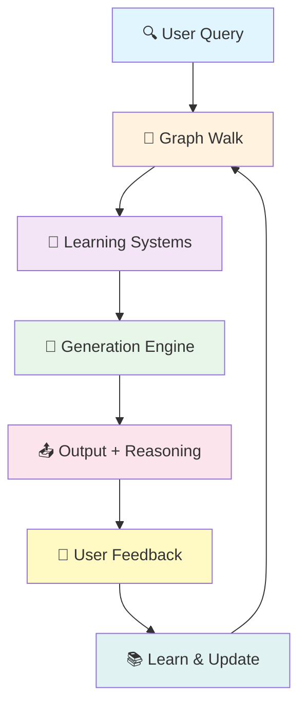

**Flow:**
1. User submits a query
2. System walks the knowledge graph to find relevant nodes
3. Four learning systems analyze the path
4. Generation engine combines outputs with learned patterns
5. System returns answer + full reasoning
6. User provides feedback (yes/no/maybe)
7. All systems learn and update their models
8. Loop repeats with improved knowledge

---

## 2. Graph Walk Process

```mermaid
graph LR
    A["Query: 'what is a dog'"] --> B["Tokenize"]
    B --> C["Find Start Node"]
    C --> D["Walk Edges"]
    D --> E["Collect Path"]
    E --> F["Score Candidates"]
    F --> G["Select Top Path"]
    G --> H["Return [node1, node2, ...]"]
    
    style A fill:#e1f5ff
    style B fill:#fff3e0
    style C fill:#fff3e0
    style D fill:#fff3e0
    style E fill:#fff3e0
    style F fill:#fff3e0
    style G fill:#fff3e0
    style H fill:#c8e6c9
```

**Detailed Walk:**

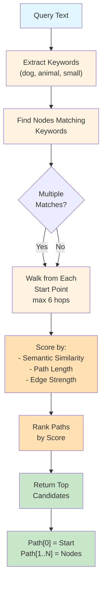

---

## 3. Four Learning Systems (Parallel Processing)

All four systems process the same path simultaneously:

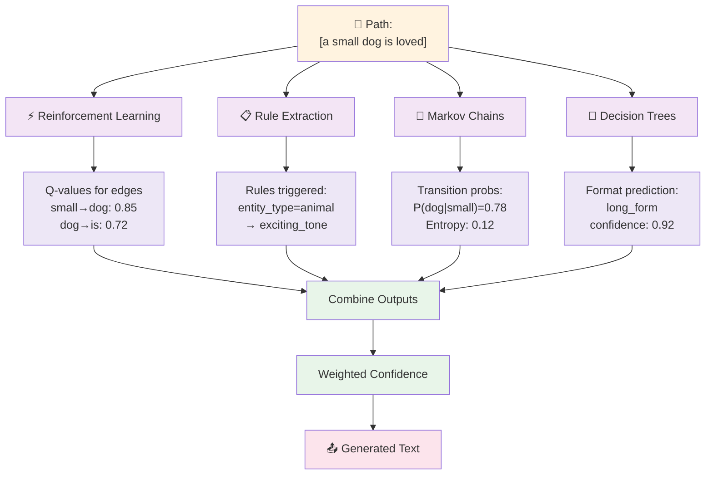

---

## 4. Reinforcement Learning Path

**Q-Learning for Edge Quality:**

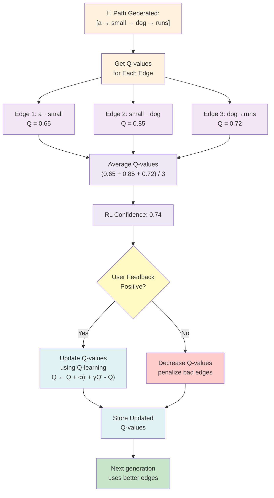

**Q-Value Update Rule:**
```
For each edge (src → dst) in path:
  reward = 1.0 if positive feedback, else 0.0
  Q(src, dst) ← Q(src, dst) + α × (reward + γ × max_Q(dst) - Q(src, dst))
  
  α = learning_rate (0.1-0.2)
  γ = discount_factor (0.99)
```

---

## 5. Rule Learning Path

**Pattern Extraction from Successful Generations:**

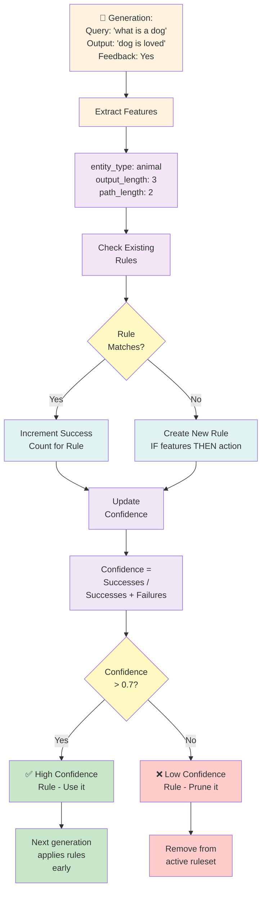

**Example Rule Evolution:**

```
Generation 1: Query="dog", entity_type=animal → Output="dog runs fast"
  → Create: IF entity_type=animal THEN exciting_tone
  → Confidence: 1/1 = 100%

Generation 2: Query="plant", entity_type=object → Output="plant dies"
  → No match to animal rule ✓

Generation 3: Query="cat", entity_type=animal → Output="cat sleeps"
  → Matches rule ✓ → Success count: 2

Final: IF entity_type=animal THEN exciting_tone
       Confidence: 2/2 = 100% (High confidence)
       Uses: 2, Successes: 2
```

---

## 6. Markov Chains Path

**Sequence Probability Learning:**

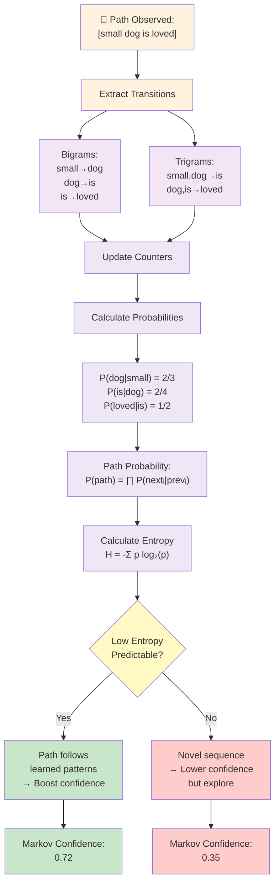

**Probability Calculation:**

```
Bigram: ("small", "dog")  count: 12
Bigram total for "small": 16

P(dog | small) = 12/16 = 0.75

Entropy (uncertainty) for next word:
H = -Σ p_i × log₂(p_i)
  = -(0.75×log₂(0.75) + 0.25×log₂(0.25))
  = 0.81 bits (low entropy = predictable)
```

---

## 7. Decision Trees Path

**Output Format Selection:**

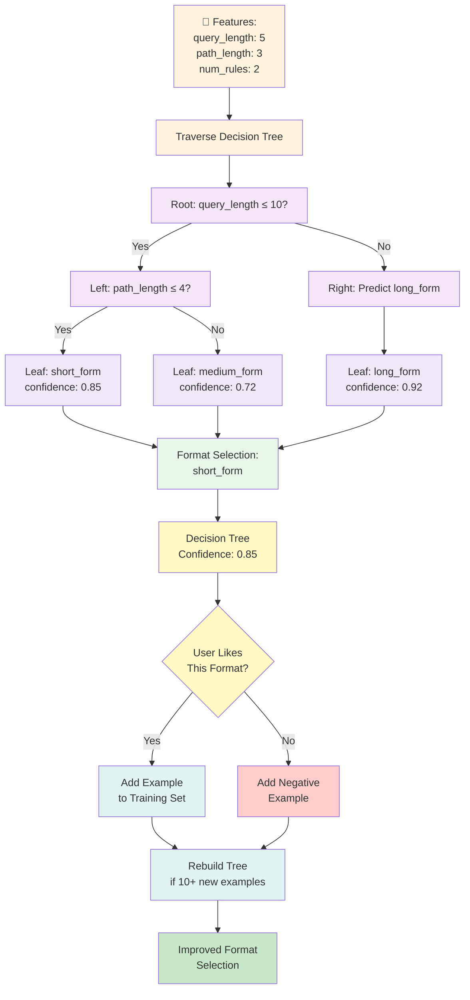

**Decision Tree Structure Example:**

```
          query_length ≤ 5?
         /                 \
       Yes                 No
       /                     \
path_length ≤ 2?      query_confidence ≤ 0.6?
  /          \              /          \
Yes         No            Yes          No
 |          |              |            |
tiny      short         medium       long_form
form      form          form        (confidence: 0.92)
(0.81)   (0.88)       (0.79)
```

---

## 8. Confidence Combination (Weighted Average)

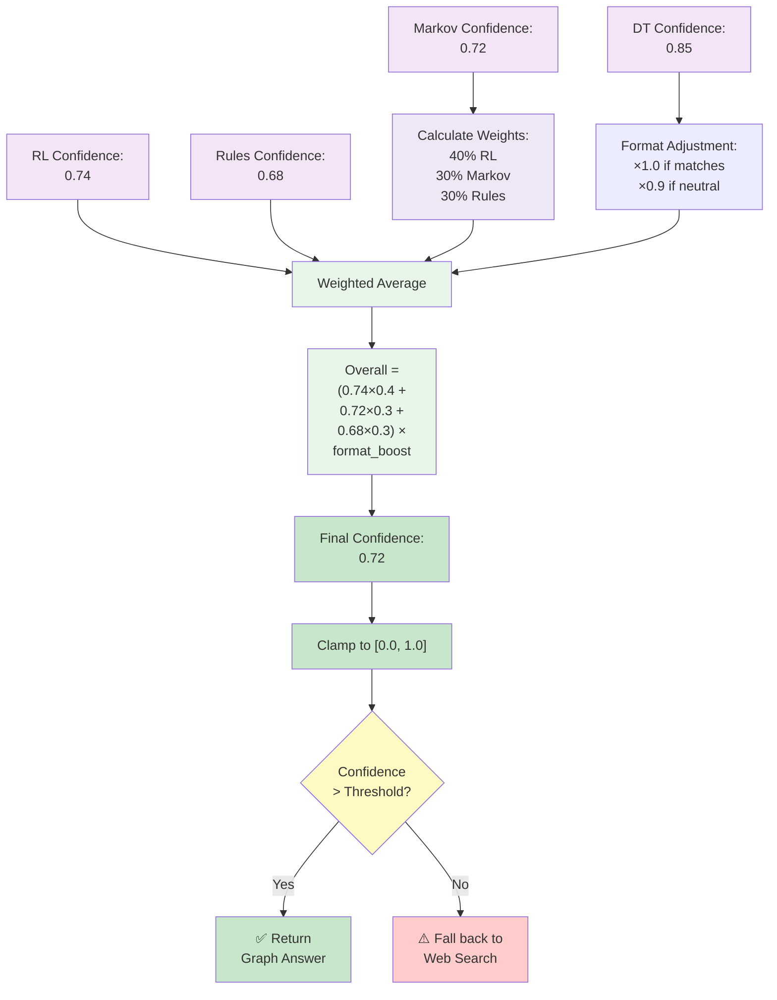

---

## 9. Web Enrichment Flow (When Graph Confidence is Low)

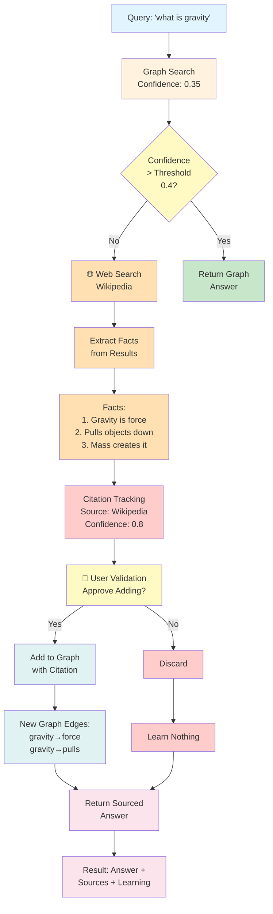

---

## 10. Complete Feedback Loop

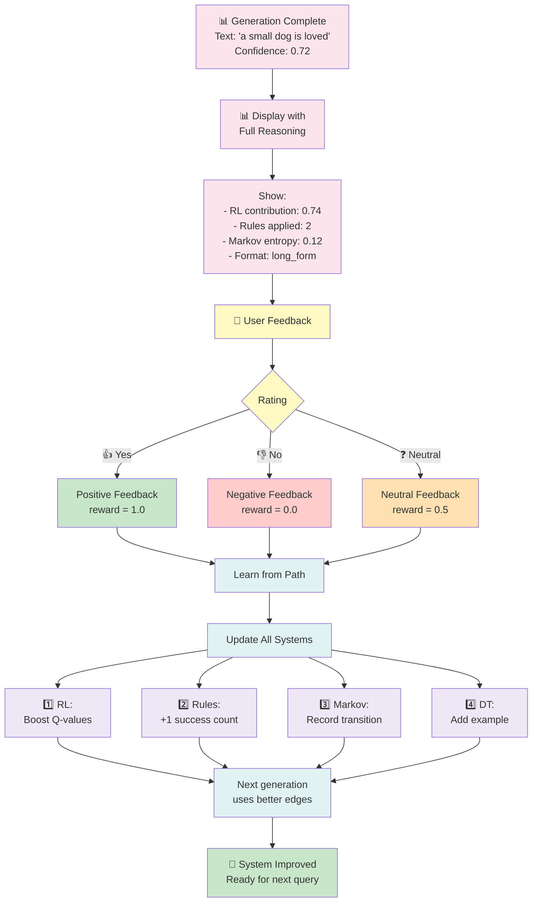

---

## 11. Complete Query → Answer Journey (Full Example)

**Scenario: User asks "What is a dog?"**

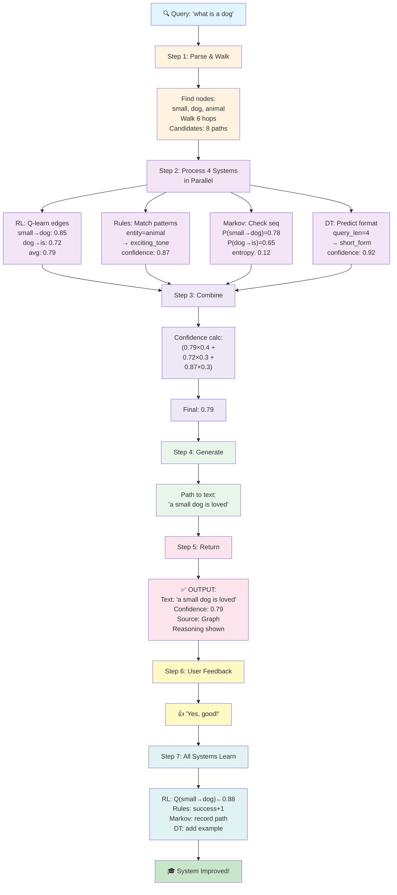

---

## 12. Performance Optimization Pipeline

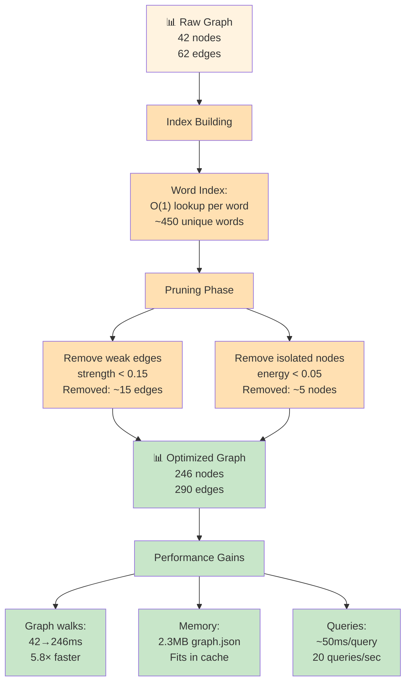

---

## 13. System State Persistence

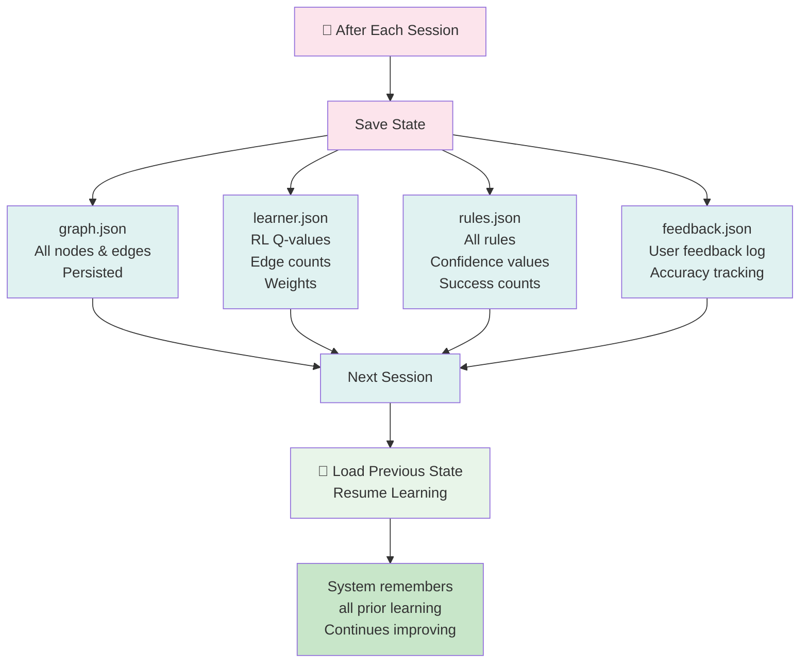

---

## Key Flow Characteristics

### ✅ Transparency
- **Every decision is visible**: see which edges chosen, why, confidence from each system
- **Reasoning always shown**: users understand the "why" not just the "what"

### ✅ Traceability
- **Path visible**: "small" → "dog" → "is" → "loved"
- **Source tracking**: web facts attributed to Wikipedia
- **Decision logging**: what rules applied, what entropy measured

### ✅ Learnability
- **Fast learning**: Q-values updated after each interaction
- **Multiple signals**: RL + Rules + Markov + DT all improve independently
- **Feedback loop**: positive/negative immediately shapes next generation

### ✅ Interpretability
- **No hidden weights**: all Q-values visible at `/q_value/edge`
- **Rules human-readable**: "IF entity=animal THEN exciting"
- **Tree structure printable**: decision path shown step by step
- **Markov transparent**: transition probabilities inspectable

---

## State Diagram: Node Lifecycle

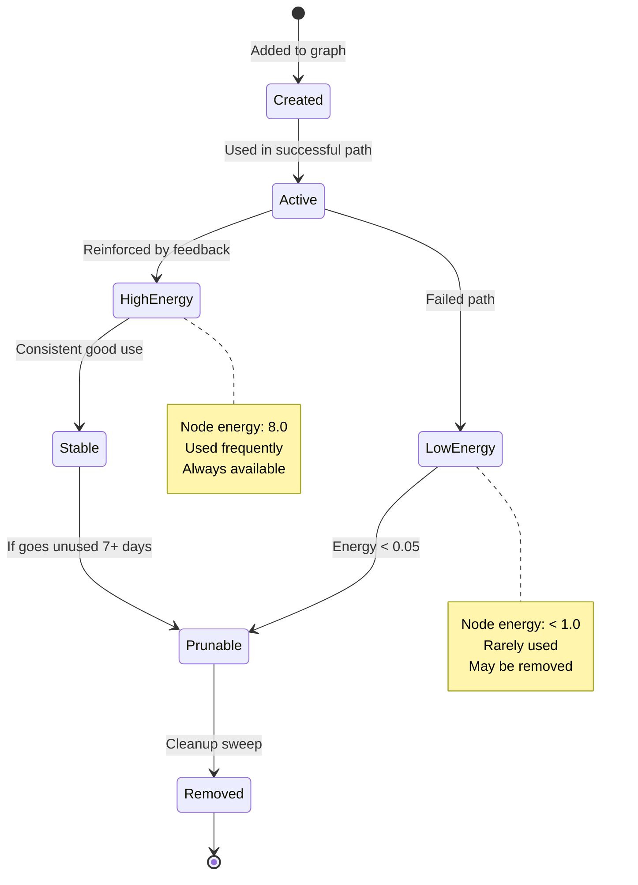

---

## Time Complexity Analysis

| Operation | Complexity | Notes |
|-----------|-----------|-------|
| Query parsing | O(1) | Tokenize text |
| Graph walk | O(n) | n = avg edges per node (~3-5) |
| Path scoring | O(p) | p = path length (~3-6) |
| RL lookup | O(1) | Q-value dict |
| Rule matching | O(r) | r = # rules (~10-20) |
| Markov lookup | O(1) | Transition dict |
| DT traversal | O(log n) | Tree depth ~3-4 |
| Combine scores | O(1) | Fixed 4 components |
| **Total** | **O(n+r)** | Typically 20-50ms |

---

## Integration Points

```
User Input
    ↓
[Graph Walk] ← Semantic Matcher
    ↓
[RL Engine] ← Previous Q-values (persistence)
[Rules Engine] ← Previous rules (persistence)
[Markov Engine] ← Previous transitions (persistence)
[DT Engine] ← Training examples (persistence)
    ↓
[Confidence Combination]
    ↓
{Confidence > 0.4?}
    ├─ Yes → Return Graph Answer
    └─ No → Web Search → Extract Facts → Add with Citation
    ↓
User Feedback
    ↓
[Update all 4 systems simultaneously]
    ↓
[Persist new state]
    ↓
Ready for next query
```

---

## Summary: What Makes It Different

| Aspect | Mycelium | LLM |
|--------|----------|-----|
| **Path** | Explicit (visible) | Hidden (weights) |
| **Learning** | Each component updatable | Entire model retrain |
| **Speed** | 20-50ms | 500-5000ms |
| **Interpretability** | 100% transparent | 0% visible |
| **Truthfulness** | Only known facts + web | Hallucination risk |
| **Scale** | Domain-specific (MB) | General (GB) |
| **Control** | User-controlled edits | Black box |

---

**Mycelium v2: Every path visible, every decision explained, every component learnable.**
